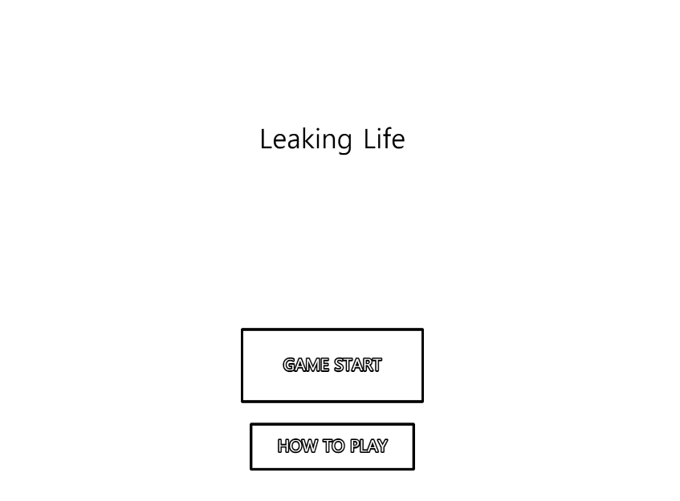
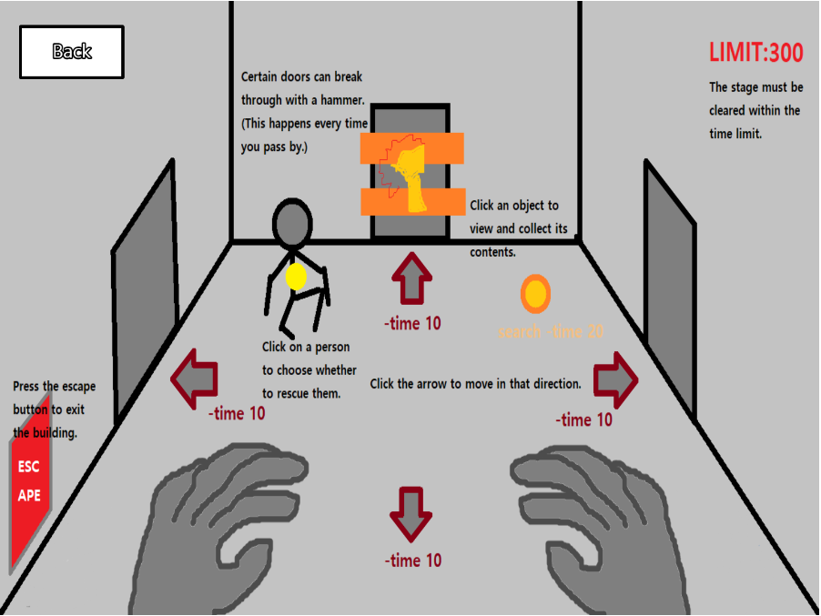
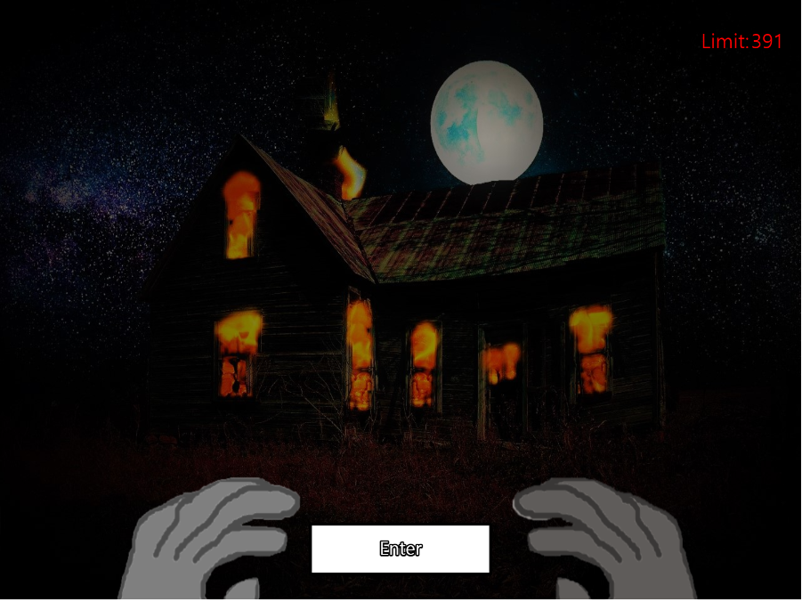
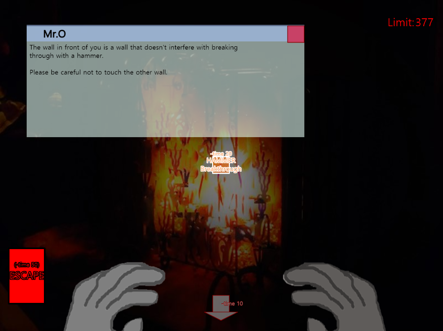
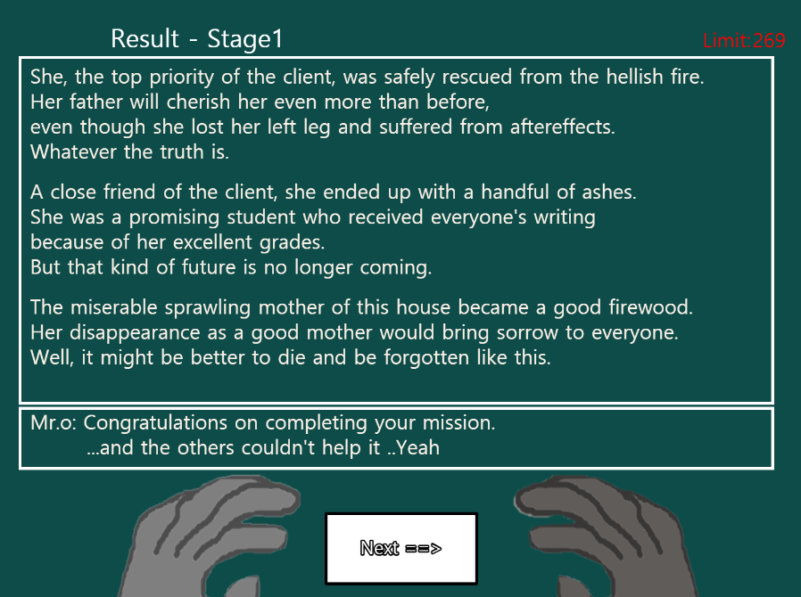

**Game Design**
=============
High Concept
============
Subject
-----
#### <pre><code>As clearly and simply as you can, explain your game idea.</code></pre>
Overall GamePlaying
-------------------
>### Each story go looking for targets along the line at the stage, please. Please find objects everywhere and guess the situation while moving. If you find a target location, there will be many targets. Pick one of the targets you want and get away from it. If you do so, the stage will be cleared and the result screen will come out and you will get an explanation. The results change depending on the object you find or the target you escaped. And move on to the next stage.
>### 각 스테이지에서 스토리라인을 따라 목표물을 찾아 이동해주세요. 이동을 하며 곳곳에 있는 오브젝트를 찾아 상황을 유추해 주세요. 목표 장소를 찾으면 여러 목표물이 있을 것입니다. 그 중 원하는 목표물을 하나만 골라 벗어나세요. 그렇게 하면 스테이지가 클리어 되고 결과 화면이 나와 설명이 나올 것 입니다. 결과는 찾은 오브젝트나 탈출시킨 목표물에 따라 변화합니다. 그리고 다음 스테이지로 넘어 가세요.
Summing-up
----------
>### A game that enters a area and rescues a person or object commissioned within a time limit.
>### 지역에 진입해 제한시간 내에 의뢰받은 사람이나 물건을 구조하는 게임
Theme
=====
Subject
-------
### **Take One, Leave The Rest**
#### <pre><code>- The theme/setting/scenario/mechanic of your game must be something that involves this theme.</code></pre>
How it works
------------
>### When you get to the room with the target, the target will be placed. Take One, Leave The Rest, you can only choose one of these targets. As soon as you select it, you will go straight to the result screen. As soon as I saw the theme, I thought of a system that would pick one and throw the rest away.
>### 당신이 목표물이 있는 방에 도착하면 목표물들이 놓여 있을 겁니다. 여기서 'Take One, Leave The Rest', 당신은 이 중 한 목표물만 고를 수 있습니다. 선택하는 순간 결과 화면으로 직행하게 됩니다. 이렇게 하나를 고르고 나머지를 버리게 되는 시스템을 테마를 보자마자 떠올렸었습니다. 
Mock Ups
=========

